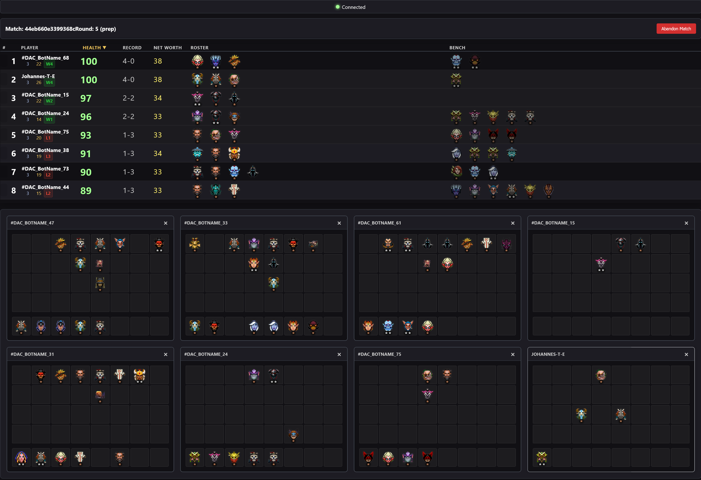

# Underlords GSI Unified

A real-time scoreboard and match tracker for Dota Underlords using the Game State Integration (GSI) API.



*Real-time match tracking with live player stats, WebSocket updates, and comprehensive game state monitoring*

## Features

- **Widget-based Dashboard** - Customizable dashboard with draggable widgets
  - Scoreboard widget with sortable columns and customizable display
  - Individual player board widgets showing unit positions and compositions
  - All player boards widget for overview of all players
  - Unit changes widget tracking real-time unit additions, removals, and position changes
- **Real-time Change Detection** - Automatic detection and tracking of:
  - Unit additions and removals
  - Unit position changes
  - Level and XP changes
  - Gold and net worth changes
  - Health and streak changes
- **Real-time Match Tracking** - WebSocket-based live updates
- **Match History** - View and manage past matches with full replay capability
- **Settings System** - Comprehensive settings for appearance, gameplay, and advanced options
- **Modern React + TypeScript Frontend** - Built with atomic design principles
- **Flask Backend with SQLite Database** - Efficient data storage and retrieval

## Tech Stack

### Backend
- Python 3.x
- Flask + Flask-SocketIO
- SQLite database

### Frontend
- React 19
- TypeScript
- Redux Toolkit (state management)
- React Router (navigation)
- Socket.IO Client (WebSocket)
- Vite (build tool)

## Setup

### 1. Install Python Dependencies

```bash
pip install -r requirements.txt
```

### 2. Install Frontend Dependencies

```bash
cd frontend
npm install
```

## Running the Application

### Development Mode (Recommended for Development)

Run both servers in separate terminals:

**Terminal 1 - Flask Backend:**
```bash
python -m backend.app
```
Or from the project root:
```bash
cd backend
python app.py
```
This starts the Flask server on `http://localhost:3000`

**Terminal 2 - React Frontend:**
```bash
cd frontend
npm run dev
```
This starts the Vite dev server on `http://localhost:5173`

Open `http://localhost:5173` in your browser for the React app with Hot Module Replacement (HMR).

### Production Mode

Build the React app and serve it from Flask:

```bash
# Build the React app
cd frontend
npm run build
cd ..

# Run Flask with production flag
PRODUCTION=true python -m backend.app
```
Or on Windows:
```bash
set PRODUCTION=true
python -m backend.app
```
Or on PowerShell:
```bash
$env:PRODUCTION="true"
python -m backend.app
```

Open `http://localhost:3000` in your browser.

## Project Structure

```
underlords_gsi_unified/
├── backend/                    # Python backend
│   ├── __init__.py
│   ├── app.py                  # Main application entry point
│   ├── config.py               # Configuration and Flask setup
│   ├── database.py             # Database management and queries
│   ├── game_state.py           # Game state management and snapshots
│   ├── gsi_handler.py          # GSI data processing and validation
│   ├── change_detector.py      # Change detection system
│   ├── routes.py               # API routes and WebSocket handlers
│   └── utils.py                # Utility functions
├── frontend/                   # React frontend
│   ├── src/
│   │   ├── components/         # Shared React components
│   │   │   ├── ui/             # Reusable UI components (Button, Badge, Icon, HealthDisplay, etc.)
│   │   │   ├── shared/         # Shared app components (NavigationBar, ConnectionStatusBar, etc.)
│   │   │   ├── layout/         # Layout templates (AppLayout, MainContentTemplate, etc.)
│   │   │   └── widgets/        # Widget base component (resize, drag, persistence)
│   │   ├── features/           # Feature-based modules (self-contained)
│   │   │   ├── scoreboard/     # Scoreboard feature
│   │   │   │   ├── components/ # ScoreboardTable, ScoreboardHeader, etc.
│   │   │   │   ├── hooks/       # useScoreboardSettings
│   │   │   │   └── ScoreboardWidget.tsx
│   │   │   ├── player-board/   # Player board feature
│   │   │   │   ├── components/ # PlayerBoard, RosterGrid, BenchGrid
│   │   │   │   ├── hooks/       # useUnitPositions
│   │   │   │   └── PlayerBoardWidget.tsx
│   │   │   ├── all-player-boards/ # All player boards feature
│   │   │   │   └── AllPlayerBoardsWidget.tsx
│   │   │   ├── unit-changes/   # Unit changes feature
│   │   │   │   └── UnitChangesWidget.tsx
│   │   │   └── match-management/ # Match management feature
│   │   │       ├── components/ # MatchesTable, MatchDetailPanel, etc.
│   │   │       └── MatchesContainer.tsx
│   │   ├── pages/              # Page components (thin route wrappers)
│   │   │   ├── Dashboard.tsx   # Main dashboard page
│   │   │   └── MatchManagement.tsx # Match management page
│   │   ├── store/              # Redux store
│   │   │   ├── store.ts        # Store configuration
│   │   │   ├── matchSlice.ts   # Match state
│   │   │   ├── boardSlice.ts   # Board data state
│   │   │   ├── changesSlice.ts # Change tracking state
│   │   │   ├── connectionSlice.ts # WebSocket connection
│   │   │   ├── dashboardSlice.ts  # Dashboard widget state
│   │   │   ├── matchesSlice.ts # Matches list
│   │   │   └── settingsSlice.ts   # Settings state
│   │   ├── services/           # API & WebSocket services
│   │   │   ├── api.ts          # REST API client
│   │   │   └── websocket.ts    # WebSocket client
│   │   ├── hooks/              # Custom hooks
│   │   │   ├── redux.ts        # Typed Redux hooks
│   │   │   ├── useSettings.ts
│   │   │   ├── usePlayerChanges.ts
│   │   │   └── ...
│   │   ├── types/              # TypeScript types
│   │   │   └── index.ts        # Type definitions
│   │   ├── styles/             # Global CSS files
│   │   ├── utils/              # Utility functions
│   │   ├── App.tsx             # Main App component
│   │   └── main.tsx            # Entry point
│   ├── public/                 # Static assets
│   │   ├── icons/              # Hero, item, UI icons
│   │   └── underlords_heroes.json
│   ├── dist/                   # Production build output
│   ├── package.json
│   ├── vite.config.ts          # Vite configuration
│   └── tsconfig.json           # TypeScript configuration
├── documentation/              # Project documentation
│   ├── markdowns/              # Documentation markdown files
│   └── ...
├── requirements.txt            # Python dependencies
├── README.md                   # This file
└── underlords_gsi_v*.db        # SQLite database files
```

## API Endpoints

- `POST /upload` - GSI data endpoint (receives game data from Dota Underlords)
- `GET /api/status` - System status and active match information
- `GET /api/health` - Health check with database and queue status
- `GET /api/matches` - List all matches
- `GET /api/matches/<match_id>/changes` - Get changes for a match (supports query params: `account_id`, `limit`, `round_number`, `round_phase`)
- `DELETE /api/matches/<match_id>` - Delete a match
- `POST /api/abandon_match` - Abandon current active match

## WebSocket Events

### Client → Server
- `test_connection` - Test WebSocket connection

### Server → Client
- `connection_response` - Connection confirmation sent on connect
- `match_update` - Real-time match data updates (sent when game state changes)
- `match_abandoned` - Match abandonment notification
- `match_ended` - Match end notification
- `player_changes` - Real-time player change events (unit changes, position changes, etc.)
- `test_response` - Test response for connection testing

## Development Notes

### CORS Configuration
In development mode, Flask is configured to allow CORS from `http://localhost:5173` (Vite dev server). The backend runs on port 3000 and accepts GSI data from the game.

### Proxy Configuration
The Vite dev server proxies API requests and WebSocket connections to Flask on port 3000. This allows the frontend dev server to communicate with the backend seamlessly.

### Hot Module Replacement
In development mode, the React app supports HMR for instant feedback on code changes.

### Change Detection System
The backend includes a sophisticated change detection system (`change_detector.py`) that:
- Tracks unit additions, removals, and position changes
- Monitors player stats (health, gold, level, XP, etc.)
- Maintains an in-memory buffer of changes for active matches
- Calculates changes from database snapshots for historical matches
- Emits real-time change events via WebSocket

### Widget System
The frontend uses a widget-based dashboard system:
- Widgets can be added, removed, and repositioned
- Widget positions are persisted in localStorage
- Multiple instances of the same widget type are supported
- Widgets include: Scoreboard, Player Boards, All Player Boards, and Unit Changes

### Feature-Based Architecture
The frontend follows a feature-based architecture:
- **Features**: Self-contained modules with their own components, hooks, and logic
  - Each feature is independent and can be developed/maintained separately
  - Features contain their own components, hooks, and types
- **Shared Components**: Reusable UI components used across features
  - `components/ui/`: Reusable UI primitives (Button, Badge, Icon, HealthDisplay, etc.)
  - `components/shared/`: App-wide shared components (NavigationBar, ConnectionStatusBar, etc.)
  - `components/layout/`: Layout templates (AppLayout, MainContentTemplate, etc.)
  - `components/widgets/`: Base widget component for draggable/resizable features

## Building for Production

```bash
cd frontend
npm run build
```

This creates an optimized production build in `frontend/dist/` that Flask can serve.

## Environment Variables

- `DEBUG` - Enable Flask debug mode (default: `true`)
- `PRODUCTION` - Enable production mode to serve React build (default: `false`)
- `SECRET_KEY` - Flask secret key
- `LOG_LEVEL` - Logging level

## License

MIT

