# Underlords GSI Unified

A real-time scoreboard and match tracker for Dota Underlords using the Game State Integration (GSI) API.

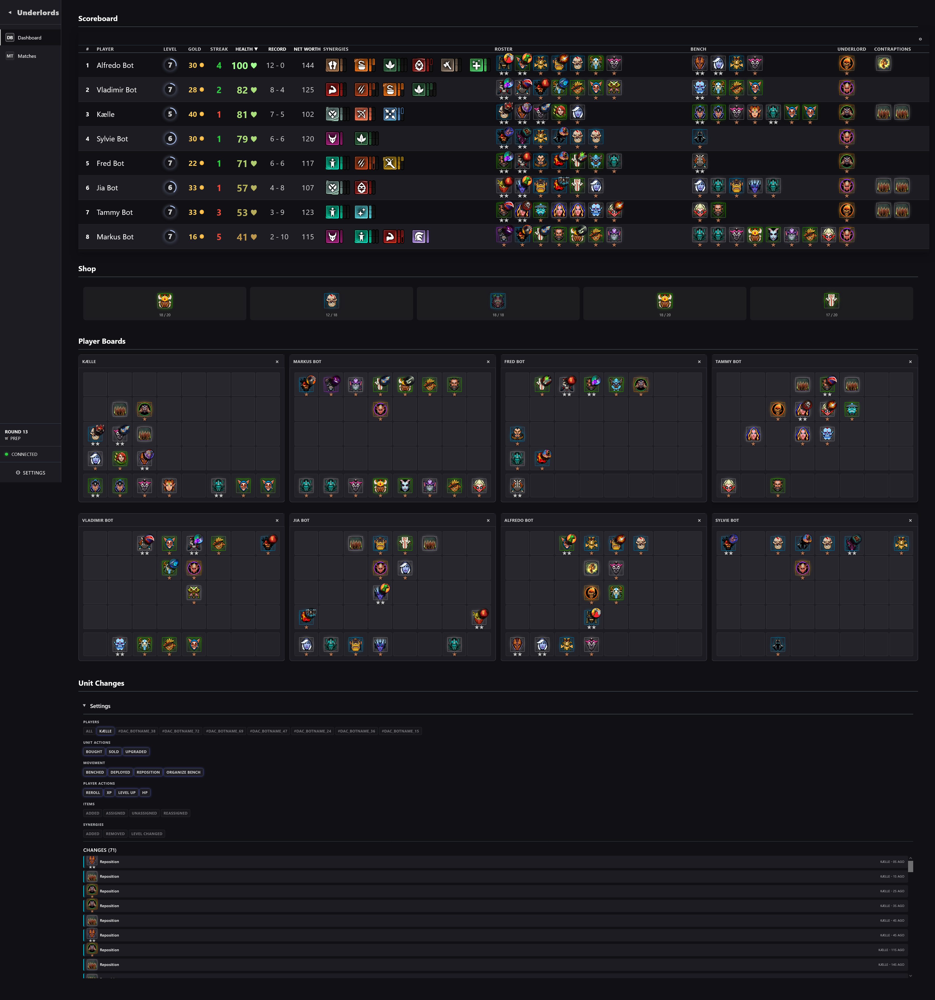

*Real-time match tracking with live player stats, WebSocket updates, and comprehensive game state monitoring*

## Features

- **Dashboard** - Central hub with scoreboard, player boards, unit changes, and shop display sections
- **Scoreboard** - Standalone sortable scoreboard with customizable columns (place, player, level, gold, streak, health, record, net worth, roster, synergies)
- **Player Boards** - All-players grid overview and individual player board views showing unit positions, compositions, items, and synergies
- **Shop Display** - Live shop view for the private player with reroll cost and lock status
- **Combat Results** - Combat history with per-round win/loss/draw tracking and opponent records
- **Hero Pool Stats** - Hero pool statistics grouped by synergy with build suggestions
- **Build Creator** - Create, save, and manage board compositions with synergy calculations and database persistence
- **Heroes Browser** - Full hero catalog with tier/synergy/rank filters, grid and table views, and detail pages with abilities and stats
- **Items Browser** - Full item catalog with tier/type filters and detail pages with descriptions
- **Match Management** - View, replay, and delete past matches with full historical change replay
- **Settings** - Settings drawer for appearance, gameplay, and advanced options
- **Real-time Change Detection** - Automatic detection and tracking of:
  - Unit purchases, sales, upgrades, repositions, deploys, and benchings
  - Rerolls, XP purchases, and level-ups
  - Item additions, assignments, unassignments, and reassignments
  - Synergy additions, removals, and level changes
  - Health, gold, and streak changes
- **Real-time Match Tracking** - WebSocket-based live updates with round and phase tracking

## Tech Stack

### Backend
- Python 3.x
- Flask 3.1.2 + Flask-SocketIO 5.5.1
- Flask-CORS 6.0.1
- SQLite database

### Frontend
- React 19.2.0
- TypeScript 5.9.3
- Redux Toolkit 2.9.1 (state management)
- React Router DOM 7.9.4 (navigation)
- Socket.IO Client 4.8.1 (WebSocket)
- Vite 7.1.7 (build tool)

## Setup

### 1. Install Python Dependencies

```bash
pip install -r requirements.txt
```

### 2. Install Frontend Dependencies

```bash
cd frontend
npm install
```

## Running the Application

### Development Mode (Recommended for Development)

Run both servers in separate terminals:

**Terminal 1 - Flask Backend:**
```bash
python -m backend.app
```
Or from the project root:
```bash
cd backend
python app.py
```
This starts the Flask server on `http://localhost:3000`

**Terminal 2 - React Frontend:**
```bash
cd frontend
npm run dev
```
This starts the Vite dev server on `http://localhost:5173`

Open `http://localhost:5173` in your browser for the React app with Hot Module Replacement (HMR).

### Production Mode

Build the React app and serve it from Flask:

```bash
# Build the React app
cd frontend
npm run build
cd ..

# Run Flask with production flag
PRODUCTION=true python -m backend.app
```
Or on Windows:
```bash
set PRODUCTION=true
python -m backend.app
```
Or on PowerShell:
```bash
$env:PRODUCTION="true"
python -m backend.app
```

Open `http://localhost:3000` in your browser.

## Project Structure

```
underlords_gsi_unified/
├── backend/                    # Python backend
│   ├── __init__.py
│   ├── app.py                  # Main application entry point
│   ├── config.py               # Configuration and Flask setup
│   ├── database.py             # Database management and queries
│   ├── game_state.py           # Game state management, match lifecycle, combat tracking
│   ├── gsi_handler.py          # GSI data processing, validation, and DB writer thread
│   ├── change_detector.py      # Change detection system
│   ├── routes.py               # API routes, build endpoints, and WebSocket handlers
│   └── utils.py                # Utility functions
├── frontend/                   # React frontend
│   ├── src/
│   │   ├── components/         # Shared React components
│   │   │   ├── ui/             # Reusable UI components (Button, Badge, Icon, HealthDisplay,
│   │   │   │                   #   HeroPortrait, AbilityDisplay, ItemDisplay, SynergyDisplay, etc.)
│   │   │   ├── shared/         # Shared app components (NavigationBar, ConnectionStatusBar, etc.)
│   │   │   ├── layout/         # Layout templates (AppLayout, MainContentTemplate, SidebarLayoutTemplate)
│   │   │   ├── charts/         # Chart components (SynergyPoolBarChart)
│   │   │   └── widgets/        # Widget base component (resize, drag, persistence)
│   │   ├── features/           # Feature-based modules (self-contained)
│   │   │   ├── scoreboard/     # Scoreboard feature (table, settings, synergy toolbar)
│   │   │   ├── player-board/   # Player board feature (roster grid, bench grid, unit positions)
│   │   │   ├── all-player-boards/ # All player boards overview
│   │   │   ├── unit-changes/   # Unit changes tracking and display
│   │   │   ├── match-management/ # Match history list, detail panel, replay
│   │   │   ├── shop/           # Shop display feature
│   │   │   ├── combat-results/ # Combat results tracking and display
│   │   │   ├── hero-pool-stats/ # Hero pool statistics by synergy
│   │   │   ├── build-creator/  # Build creator with board editor and synergy calculations
│   │   │   ├── heroes/         # Heroes browser (catalog, filters, detail pages, abilities)
│   │   │   ├── items/          # Items browser (catalog, filters, detail pages)
│   │   │   └── settings/       # Settings drawer and configuration
│   │   ├── pages/              # Page components (route wrappers)
│   │   │   ├── Dashboard.tsx
│   │   │   ├── MatchManagement.tsx
│   │   │   ├── ScoreboardPage.tsx
│   │   │   ├── ShopPage.tsx
│   │   │   ├── PlayerBoardsPage.tsx
│   │   │   ├── PlayerBoardPage.tsx
│   │   │   ├── CombatResultsPage.tsx
│   │   │   └── BuildCreatorPage.tsx
│   │   ├── store/              # Redux store
│   │   │   ├── store.ts        # Store configuration
│   │   │   ├── matchSlice.ts   # Active match state (players, round info, combat history)
│   │   │   ├── boardSlice.ts   # Board data state
│   │   │   ├── changesSlice.ts # Change tracking state
│   │   │   ├── connectionSlice.ts # WebSocket connection status
│   │   │   ├── matchesSlice.ts # Saved matches list
│   │   │   └── settingsSlice.ts   # Settings state (persisted to localStorage)
│   │   ├── services/           # API & WebSocket services
│   │   │   ├── api.ts          # REST API client
│   │   │   └── websocket.ts    # WebSocket client with Redux integration
│   │   ├── contexts/           # React contexts
│   │   │   └── HeroesDataContext.tsx  # Global hero data provider
│   │   ├── hooks/              # Custom hooks
│   │   │   ├── redux.ts        # Typed Redux hooks
│   │   │   ├── useSettings.ts
│   │   │   ├── usePlayerChanges.ts
│   │   │   └── ...
│   │   ├── types/              # TypeScript types
│   │   │   └── index.ts        # Type definitions
│   │   ├── styles/             # Global CSS files
│   │   ├── utils/              # Utility functions (heroHelpers, itemHelpers, buildHelpers, etc.)
│   │   ├── App.tsx             # Main App component with routing
│   │   └── main.tsx            # Entry point
│   ├── public/                 # Static assets and game data
│   │   ├── icons/              # Hero, item, and UI icons
│   │   ├── underlords_heroes.json    # Hero data
│   │   ├── items.json                # Item data
│   │   ├── synergy_keyword_mappings.json  # Synergy mappings
│   │   ├── dac_botnames.json         # Bot name data
│   │   └── localization/             # Localization files
│   │       ├── abilities.json
│   │       ├── dac_abilities_english.json
│   │       └── items_english.json
│   ├── dist/                   # Production build output
│   ├── package.json
│   ├── vite.config.ts          # Vite configuration with proxy settings
│   └── tsconfig.json           # TypeScript configuration
├── documentation/              # Project documentation
│   ├── markdowns/              # Documentation markdown files
│   └── dataflow/               # Data flow diagrams
├── dev_log_img/                # Development log screenshots
├── requirements.txt            # Python dependencies
├── README.md                   # This file
└── underlords_gsi_v*.db        # SQLite database files
```

## Feature Showcase

### Dashboard (`/dashboard`)


The Dashboard is the central hub of the application, aggregating the most important live match information into a single view. It brings together the Scoreboard, Shop, Player Boards, Combat Results, and Hero Pool Stats sections so you can monitor the entire match state at a glance. Selecting a unit or synergy in one section highlights it across all other sections, keeping context as you navigate between data points.

**Key capabilities:**
- Aggregated view of all major match components in one page
- Cross-section unit and synergy selection syncing
- Togglable sections to show or hide individual panels
- Real-time updates as the match progresses

**Data source:** WebSocket `match_update` events update the Redux `matchSlice` in real time. Hero metadata comes from `HeroesDataContext`.

---

### Scoreboard (`/scoreboard`)

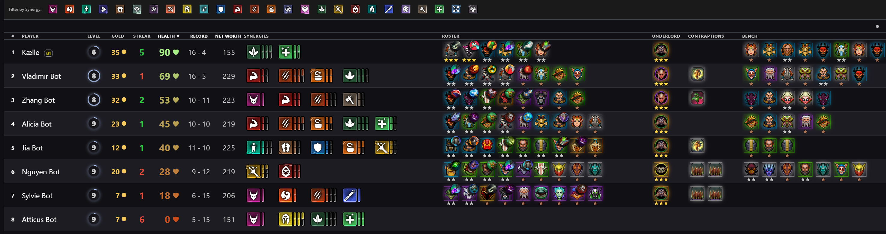

The Scoreboard displays all eight players in a sortable, customizable table that tracks the key stats of a live or historical match. Each row shows a player's placement, name, health bar, win/loss record, net worth, roster composition (unit portraits with star ranks), and active synergies with visual pip indicators. Active players are listed first, followed by eliminated players ordered by their final placement.

**Key capabilities:**
- Sort by health, record, or net worth in ascending or descending order
- Click any unit portrait to highlight that hero across the scoreboard and other views
- Synergy toolbar to filter the display by a specific synergy type
- Toggle synergy pip indicators on or off
- Customize which columns are visible and their order via settings

**Data source:** Redux `matchSlice` populated by WebSocket `match_update` events.

---

### Player Boards (`/player-boards`, `/player-board/:accountId`)

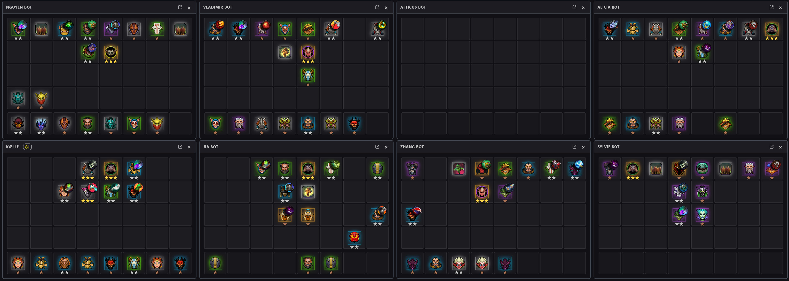

Player Boards visualize each player's board state, showing unit positions on an 8x4 roster grid with an 8-slot bench below. Units are rendered with hero portraits, star-rank indicators, and equipped items. The all-players view (`/player-boards`) displays every player's board in a responsive grid, while the single-player view (`/player-board/:accountId`) provides a larger, auto-scaling board with a sidebar for switching between players. Movement trails can optionally show where units have been repositioned.

**Key capabilities:**
- All-players grid with adjustable boards-per-row (1 through 8), saved to localStorage
- Single-player view with a sidebar player list and auto-scaling board
- Unit rank stars and item icons rendered on each unit
- Optional movement trail animations showing repositioning history
- Click to open any player's board in the single-player view

**Data source:** Redux `matchSlice` provides player state and unit positions (`position.x/y`). Updated in real time via WebSocket.

---

### Shop (`/shop`)

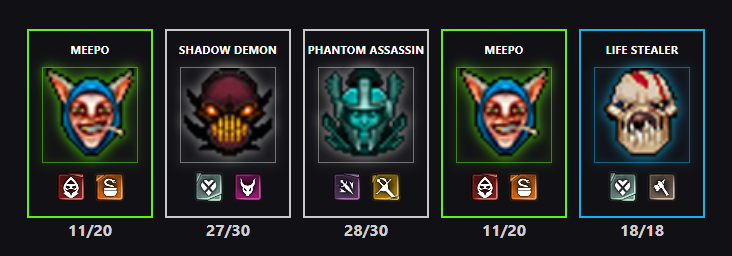

The Shop page displays the private player's current shop offering, showing the five hero slots available for purchase. Each slot shows the hero portrait, their synergy icons, and pool availability counts (remaining units out of total pool size). Empty slots display a placeholder state. The shop also shows the current reroll cost and whether the shop is locked. Selecting a hero in the shop highlights it in the Scoreboard and other views for quick cross-referencing.

**Key capabilities:**
- Five hero slots with portraits, synergy icons, and pool counts (remaining/total)
- Reroll cost and shop lock status display
- Click heroes to select and highlight them across other views
- Dims non-selected heroes when a selection is active

**Data source:** Private player state from Redux `matchSlice` (`privatePlayer.shop_units`). Pool counts calculated from all players' deployed units.

---

### Combat Results (`/combat-results`)

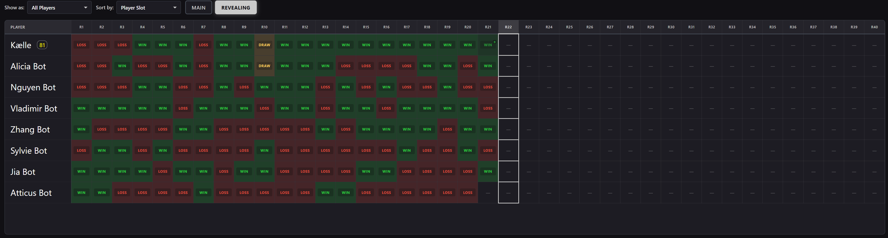

The Combat Results page provides a round-by-round combat history table where rows represent players and columns represent rounds (1 through 40). Each cell shows the combat outcome (WIN, LOSS, or DRAW) along with the opponent's name, color-coded backgrounds for quick scanning, and a bot-fight indicator where applicable. During an active combat phase, the table groups players by their current matchup and shows a countdown timer for the round.

**Key capabilities:**
- Round-by-round grid with color-coded WIN/LOSS/DRAW cells
- Filter results by a specific player via dropdown
- Sort players by slot number or current HP
- Toggle between Main and Revealing combat modes
- Hover to highlight matchup pairs across the table
- Live timer countdown during active combat rounds

**Data source:** Combat history fetched via `GET /api/matches/<match_id>/combats` for active matches. Real-time updates via WebSocket `match_update` events.

---

### Hero Pool Stats (`/hero-pool-stats`)

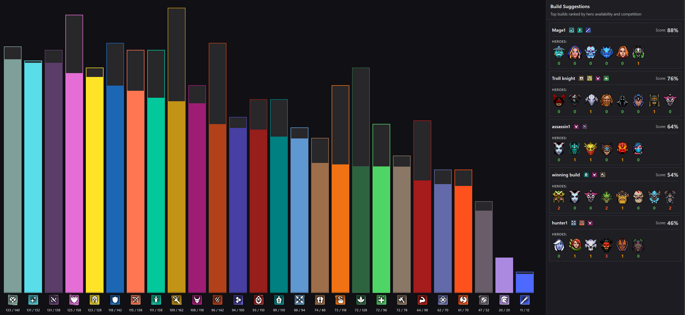

The Hero Pool Stats page gives you an analytical view of hero availability during a match. The left panel shows a bar chart of remaining heroes grouped by synergy, making it easy to see which synergy pools are depleted or still open. The right panel displays a Build Suggestions section that ranks the top 5 builds based on hero availability and how many other players are competing for the same units.

**Key capabilities:**
- Synergy pool bar chart showing remaining heroes per synergy
- Build Suggestions panel with top 5 builds ranked by availability and competition
- Each suggestion shows the build name, active synergies, hero icons with availability color coding, and competition count
- Click a suggestion to load it directly into the Build Creator

**Data source:** Calculated from current match state in Redux `matchSlice`. Pool counts derived by subtracting all players' deployed units from the total hero pool.

---

### Build Creator (`/build-creator`)

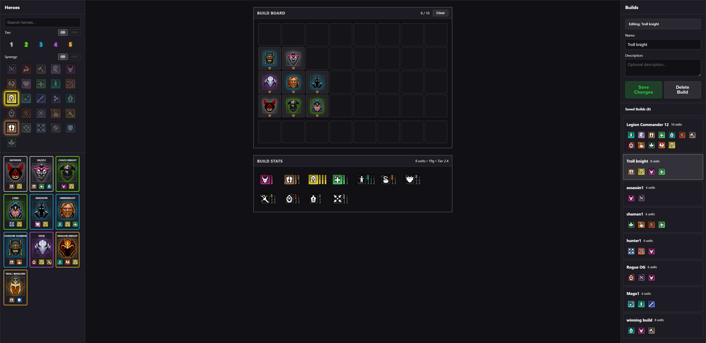

The Build Creator is a three-panel tool for planning and saving board compositions. The left panel provides a hero selection grid with search, tier filters (1-5 with AND/OR logic), and synergy filters. The center panel is an interactive board editor where you can place units by clicking, select them to change their star rank (1-3 stars), and see real-time synergy calculations with highlighting. The right panel is a build manager where you can name, describe, save, load, duplicate, and delete builds.

**Key capabilities:**
- Hero selection panel with search, tier filter (1-5), and synergy filter with AND/OR toggle
- Interactive 8x4 board editor with click-to-place unit positioning
- Star rank selector (1-3 stars) for each placed unit
- Real-time synergy calculation with visual indicators
- Hover a synergy to highlight which placed units contribute to it
- Build manager with save, load, duplicate, and delete operations
- Build name and description fields

**Data source:** Builds are persisted to the SQLite database via `POST/PUT/GET/DELETE /api/builds` REST endpoints. Hero data from `HeroesDataContext`.

---

### Heroes Browser (`/heroes`, `/heroes/:heroId`)

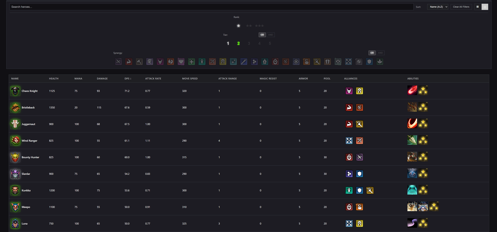

The Heroes Browser is a catalog of all heroes in the game, displayed as a grid of cards or a sortable table. Each card shows the hero portrait with a tier-colored border, name, and synergy badges. The filter bar allows searching by name, filtering by tier (1-5), synergy, and star rank, with AND/OR toggle logic for multi-select filters. The detail page (`/heroes/:heroId`) shows an enlarged hero portrait, full stat breakdown, all abilities with tooltip descriptions, and synergy badges with navigation to related heroes.

**Key capabilities:**
- Toggle between grid view (hero cards) and table view
- Search heroes by name
- Filter by tier (1-5), synergy, and star rank with AND/OR logic
- Sort by name, tier, or cost
- Clear all filters with one click
- Detail page with full hero stats, abilities with descriptions, and synergy links
- Navigate between heroes from the detail page

**Data source:** Static hero data from `HeroesDataContext` (loads `underlords_heroes.json`). Ability descriptions from localization files (`abilities.json`, `dac_abilities_english.json`).

---

### Items Browser (`/items`, `/items/:itemId`)

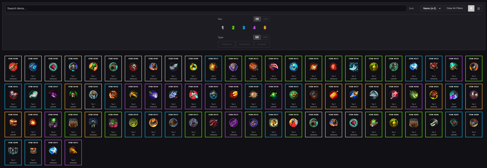

The Items Browser is a catalog of all items in the game, with the same grid/table view toggle as the Heroes Browser. Each item card displays the item icon, name, tier, and type. Filters let you search by name, filter by tier and item type, and sort the results. The detail page (`/items/:itemId`) shows the full item icon, description text, stats, and tier information.

**Key capabilities:**
- Toggle between grid view (item cards) and table view
- Search items by name
- Filter by tier (1-5) and item type with AND/OR logic
- Sort by various item properties
- Clear all filters with one click
- Detail page with full item description and stats

**Data source:** Static item data loaded via `useItemsData` hook (fetches `items.json` with localStorage caching). Descriptions from `items_english.json` localization file.

---

### Match Management (`/match-management`)

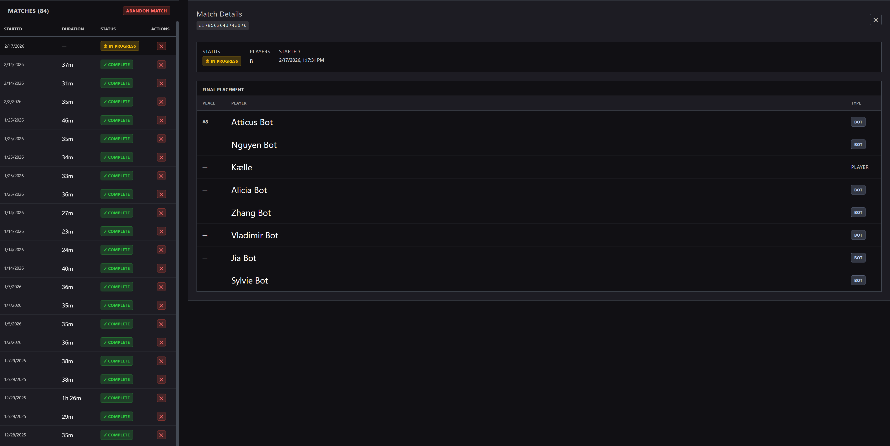

The Match Management page provides a sidebar list of all saved matches alongside a detail panel for the selected match. The match list shows each match's start time, duration, and status (active, completed, or abandoned). Selecting a match displays its full details: match ID, status badge, player count, start and end timestamps, total duration, and a placement board showing all players' final standings. You can delete any completed match or abandon the currently active match.

**Key capabilities:**
- Sidebar match list with start time, duration, and status indicators
- Match detail panel with ID, player count, timestamps, and duration
- Final placement board showing all players' finishing positions
- Delete matches with a confirmation dialog
- Abandon the active match with one click

**Data source:** Match list fetched via `GET /api/matches` REST endpoint, stored in Redux `matchesSlice`. Active match abandonment via `POST /api/abandon_match`.

---

### Settings (drawer overlay)

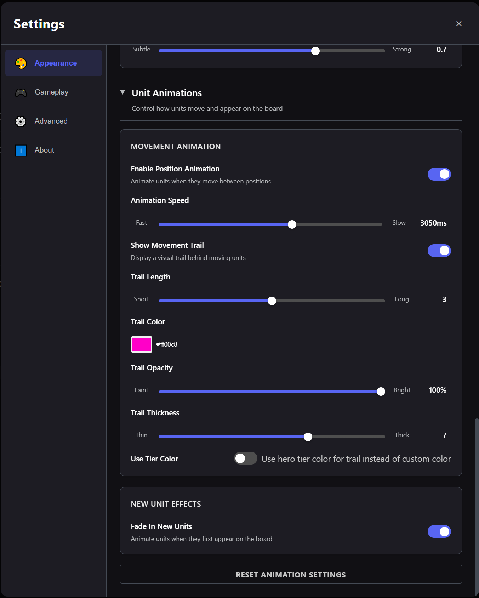

The Settings drawer slides in as an overlay panel with category-based navigation. Categories include Appearance (theme and UI preferences), Gameplay (game-related display options), Advanced (export/import settings as JSON, reset all settings to defaults), and About (version information and credits). All settings are persisted to localStorage and restored automatically on page load.

**Key capabilities:**
- Category sidebar navigation (Appearance, Gameplay, Advanced, About)
- Individual setting toggles and input controls
- Export all settings as a downloadable JSON file
- Import settings from a JSON file
- Reset all settings to defaults with a confirmation prompt
- Settings persist across browser sessions via localStorage

## API Endpoints

### GSI
- `POST /upload` - GSI data endpoint (receives game data from Dota Underlords)

### System
- `GET /api/status` - System status and active match information
- `GET /api/health` - Health check with database and queue status

### Matches
- `GET /api/matches` - List all matches
- `GET /api/matches/<match_id>/changes` - Get changes for a match (supports query params: `account_id`, `limit`, `round_number`, `round_phase`)
- `GET /api/matches/<match_id>/combats` - Get combat history for an active match
- `DELETE /api/matches/<match_id>` - Delete a match
- `POST /api/abandon_match` - Abandon current active match

### Builds
- `GET /api/builds` - List all saved builds
- `GET /api/builds/<build_id>` - Get a specific build
- `POST /api/builds` - Create a new build
- `PUT /api/builds/<build_id>` - Update an existing build
- `DELETE /api/builds/<build_id>` - Delete a build

## WebSocket Events

### Client → Server
- `test_connection` - Test WebSocket connection

### Server → Client
- `connection_response` - Connection confirmation sent on connect (includes current game state if a match is active)
- `match_update` - Real-time match data updates (players, private state, round info, combat results)
- `match_abandoned` - Match abandonment notification
- `match_ended` - Match end notification
- `player_changes` - Real-time player change events (unit changes, item changes, stat changes, etc.)
- `test_response` - Test response for connection testing

## Development Notes

### CORS Configuration
In development mode, Flask is configured to allow CORS from `http://localhost:5173` (Vite dev server). The backend runs on port 3000 and accepts GSI data from the game.

### Proxy Configuration
The Vite dev server proxies API requests (`/api`), WebSocket connections (`/socket.io`), and the GSI endpoint (`/upload`) to Flask on port 3000. This allows the frontend dev server to communicate with the backend seamlessly.

### Hot Module Replacement
In development mode, the React app supports HMR for instant feedback on code changes.

### Change Detection System
The backend includes a change detection system (`change_detector.py`) that:
- Detects unit changes: purchases, sales, upgrades, repositions, deploys, and benchings
- Tracks player actions: rerolls, XP purchases, level-ups, HP changes
- Monitors item changes: additions, assignments, unassignments, and reassignments
- Tracks synergy changes: additions, removals, and level changes
- Maintains an in-memory buffer of changes for active matches
- Calculates changes from database snapshots for historical matches
- Emits real-time change events via WebSocket

### Combat and Round Tracking
The backend tracks combat results per round, including win/loss/draw outcomes and opponent information. Round number and phase (prep/combat) are tracked via combat_type transitions in the GSI data.

### Static Game Data
The frontend loads game data from static JSON files in `public/`:
- `underlords_heroes.json` - Hero definitions (served globally via `HeroesDataContext`)
- `items.json` - Item definitions (loaded via `useItemsData` hook with localStorage caching)
- Localization files for abilities and items
- Synergy keyword mappings and bot name data

### Build Creator
The Build Creator feature allows users to create and manage board compositions. Builds are persisted to the SQLite database via dedicated REST endpoints and include synergy calculations computed on the frontend.

### Feature-Based Architecture
The frontend follows a feature-based architecture:
- **Features**: Self-contained modules in `features/` with their own components, hooks, and logic
  - Each feature is independent and can be developed/maintained separately
  - 12 features: scoreboard, player-board, all-player-boards, unit-changes, match-management, shop, combat-results, hero-pool-stats, build-creator, heroes, items, settings
- **Shared Components**: Reusable UI components used across features
  - `components/ui/`: Reusable UI primitives (Button, Badge, Icon, HealthDisplay, HeroPortrait, AbilityDisplay, ItemDisplay, SynergyDisplay, etc.)
  - `components/shared/`: App-wide shared components (NavigationBar, ConnectionStatusBar, EmptyState, etc.)
  - `components/layout/`: Layout templates (AppLayout, MainContentTemplate, SidebarLayoutTemplate)
  - `components/charts/`: Data visualization components (SynergyPoolBarChart)
  - `components/widgets/`: Base widget component for draggable/resizable dashboard elements

### Data Flow

```
Dota Underlords Game
    ↓ POST /upload (GSI payload)
GSI Handler (gsi_handler.py)
    ↓ extract & validate player states
    ├── No active match: buffer until 8 players detected → start match
    └── Active match:
         ├── Update in-memory state (game_state.py)
         ├── Detect changes (change_detector.py)
         ├── Queue async DB write (db_write_queue)
         ├── Emit WebSocket update → Redux store → React UI
         └── Check match end conditions
```

## Building for Production

```bash
cd frontend
npm run build
```

This creates an optimized production build in `frontend/dist/` that Flask can serve.

## Environment Variables

- `DEBUG` - Enable Flask debug mode (default: `false`)
- `PRODUCTION` - Enable production mode to serve React build (default: `false`)
- `SECRET_KEY` - Flask secret key
- `LOG_LEVEL` - Logging level (default: `INFO`)

## License

MIT
